<div align="center">

# ⚡ FlowState

**An autonomous multi-agent microgrid resilience system — it predicts grid stress,
coordinates peer-to-peer energy transfer, and plans recovery before a failure spreads.**

Seven specialised agents run as a LangGraph pipeline over a 50-home community.
A 3D digital twin renders what they decide, house by house, in real time.

[](https://bit-n-build-wine.vercel.app/)
[](https://www.python.org/)
[](https://fastapi.tiangolo.com/)
[](https://langchain-ai.github.io/langgraph/)
[](https://nextjs.org/)
[](https://threejs.org/)
[](https://groq.com/)
[](#testing)

**Prithvi S P** · **Darshan Pawar** · **Chandan Kumar K**
<br><sub>Team Bit-N-Build — Decentralised Energy Systems & Micro-Grids</sub>

</div>

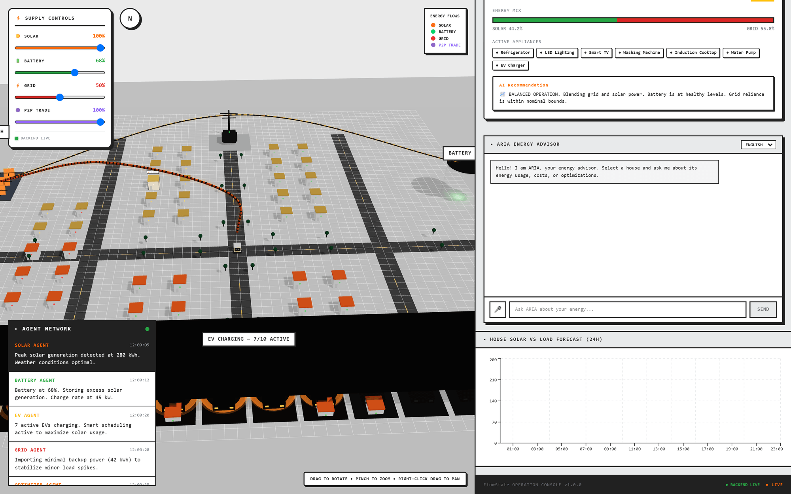

---

## Contents

- [The problem](#the-problem)
- [How FlowState works](#how-flowstate-works)
- [Screenshot tour](#screenshot-tour)
  - [The 3D digital twin](#the-3d-digital-twin)
  - [Per-house telemetry](#per-house-telemetry)
  - [The scenario simulator](#the-scenario-simulator)
  - [Five failure scenarios](#five-failure-scenarios)
  - [The autonomous resilience layer](#the-autonomous-resilience-layer)
  - [Live agent negotiation](#live-agent-negotiation)
  - [ARIA, the energy advisor](#aria-the-energy-advisor)
  - [The backend API](#the-backend-api)
- [Architecture](#architecture)
- [The resilience agent in detail](#the-resilience-agent-in-detail)
- [Repository layout](#repository-layout)
- [Quickstart](#quickstart)
- [API reference](#api-reference)
- [Testing](#testing)
- [Known issues](#known-issues)
- [Roadmap](#roadmap)
- [Ownership](#ownership)

---

## The problem

> **Challenge track — Decentralised Energy Systems & Micro-Grids**
> Create agent networks that monitor hyper-local power generation, predict grid
> failures, and autonomously execute peer-to-peer energy trading during peak demand.

Most microgrid control software is *reactive*. It notices instability after the
lights flicker, then sheds load. By then the community has already lost the cheapest
option it had: the surplus sitting on its neighbours' roofs.

FlowState is built the other way round. Every cycle, seven agents evaluate generation,
consumption, storage, EV demand and grid availability, score the community's failure
risk, and — while that risk is still climbing — find local energy and move it.

**Predict → Coordinate → Act → Stabilise.**

## How FlowState works

| Layer | What it actually does |
| --- | --- |
| **Solar agent** | Reads generation and the 24 h forecast, computes surplus against current demand, flags low-generation windows |
| **Battery agent** | Tracks state-of-charge and health, computes available discharge, recommends charge/discharge |
| **House agent** | Processes all 50 households in one vectorised pass; separates critical from flexible load and forecasts next-hour demand |
| **EV agent** | Builds charging schedules, flexibility windows, V2G eligibility and charging priority |
| **Grid agent** | Tracks pricing, availability, carbon intensity and peak hours |
| **Resilience agent** | Scores failure risk, coordinates P2P transfers between surplus and deficit homes, and writes an autonomous recovery plan |
| **Optimizer** | Resolves the remaining supply-demand mismatch: battery dispatch, EV pause, load deferral, savings and carbon |
| **Digital twin** | Renders all of it — houses, EVs, solar farm, battery, flows — and streams the agent log live |
| **ARIA** | A Groq-backed advisor that answers questions grounded in the selected house and the current community state |

---

## Screenshot tour

> Every image below was captured from the running application with the Python agent
> backend live — not from mockups.

### The 3D digital twin

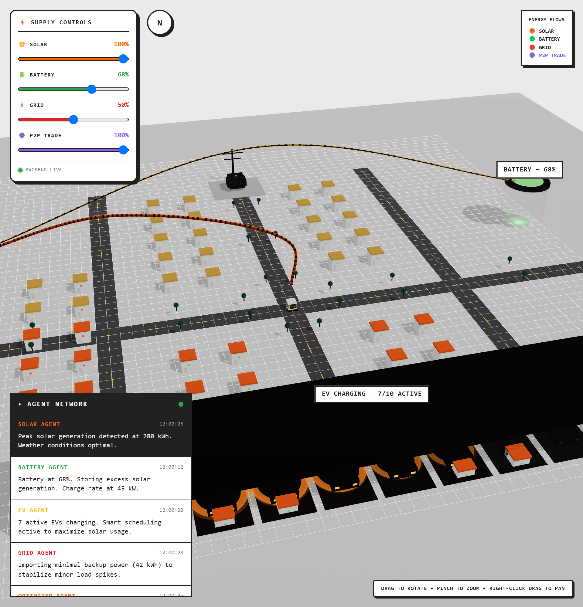

The left pane is the community: 50 homes on a street grid, a substation, the community
battery, the solar farm and the EV charging row. It is not decoration — every element is
bound to agent state.

| Scene element | Bound to |
| --- | --- |
| House roof colour | that household's renewable share this cycle |
| Orange corridor | solar dispatch from the farm into the grid |
| Green corridor | community battery discharge |
| Red corridor | grid import |
| Violet corridor | a peer-to-peer transfer between two homes |
| EV row | live count of vehicles actually charging (`7/10 ACTIVE`) |
| Battery cylinder fill | state-of-charge |
| Scene lighting and fog | the active scenario — an outage dims the whole community |
| Agent Network overlay | the live negotiation log, newest first |

The **Supply Controls** panel drives the agents directly: solar, battery, grid and P2P
availability are inputs to the next cycle, not display filters.

### Per-house telemetry

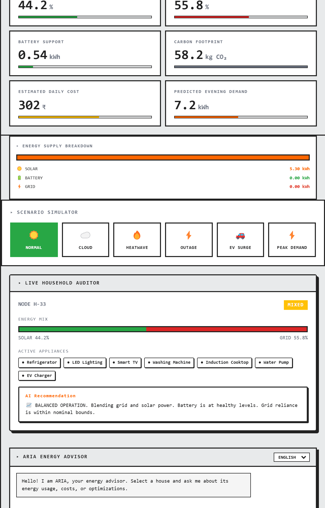

Click any house to open it. Eight metric cards, an energy supply breakdown showing
exactly how many kWh came from solar, battery and grid, and a live household auditor
tagging the home as `RENEWABLE`, `MIXED` or `GRID`.

Because the breakdown is per-source rather than a single "green score", a home reading
81% renewable during normal operation and 0% grid dependency during an island-mode
outage tells two different, verifiable stories.

### The scenario simulator

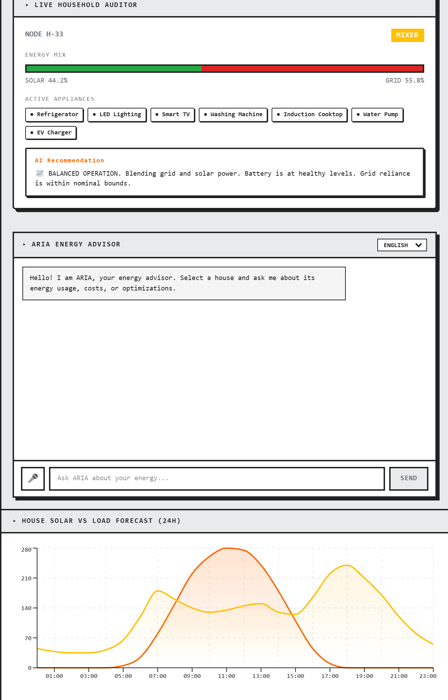

Six buttons, each mapping to a state mutation in `backend/agents/scenarios.py`:
`normal`, `cloud_cover`, `heatwave`, `grid_failure`, `ev_surge` and `peak_demand`.
Selecting one re-runs the whole agent pipeline against the mutated community state.

### Five failure scenarios

This is where a resilience system earns its name. Four of these five are bad days.

<table>
<tr>
<td width="50%">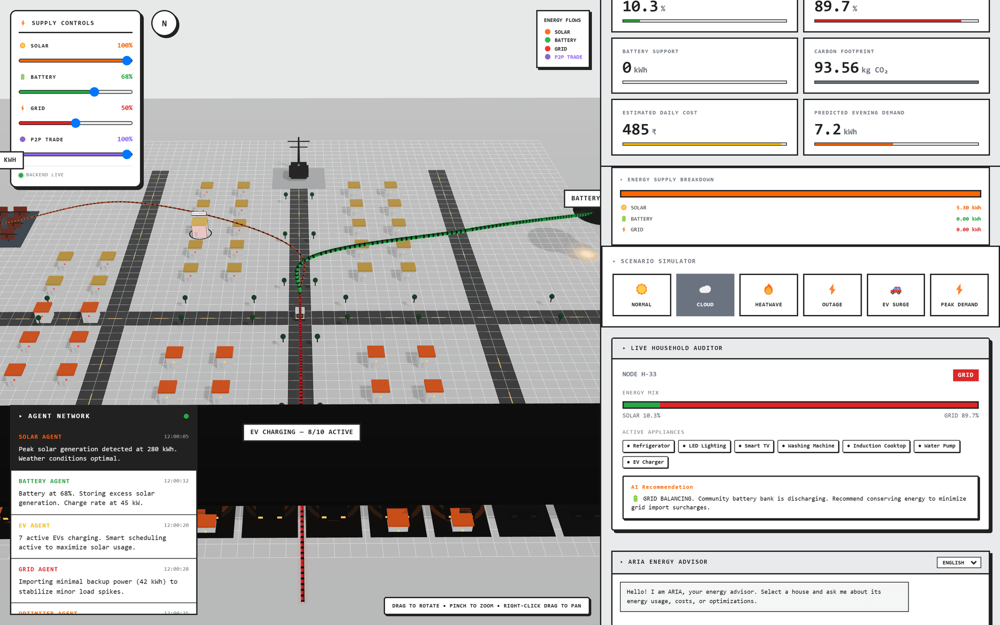</td>
<td width="50%">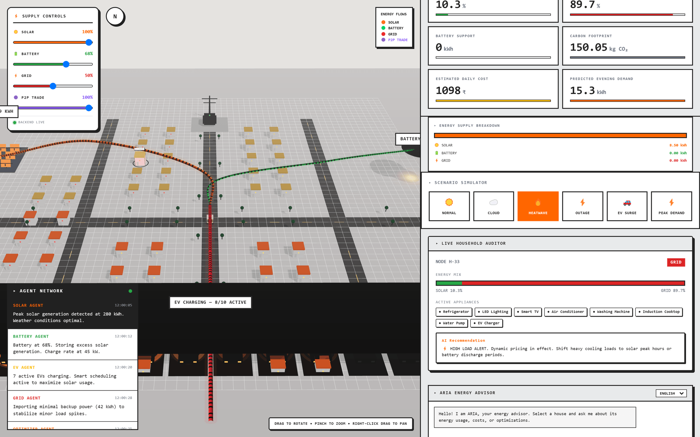</td>
</tr>
<tr>
<td><b>Cloud cover</b> — generation collapses against an unchanged load. The solar
corridor thins, the battery corridor takes over, and the optimizer starts leaning on
stored energy rather than importing.</td>
<td><b>Heatwave</b> — cooling load climbs across every household at once. Demand
pressure is the heaviest term in the risk score, so this is the scenario that moves the
needle fastest without anything actually breaking.</td>
</tr>
<tr>
<td width="50%">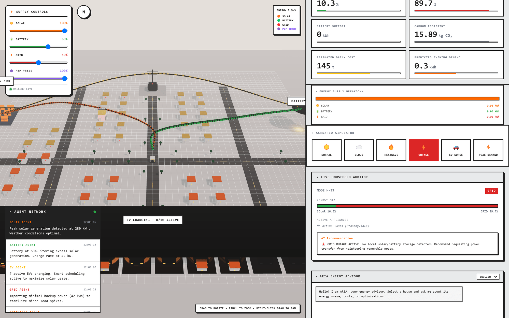</td>
<td width="50%">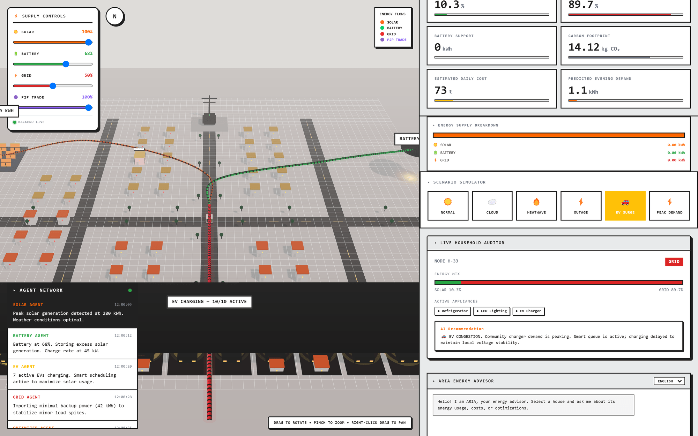</td>
</tr>
<tr>
<td><b>Grid outage</b> — grid availability goes false, which alone contributes 0.30 to
the risk score. The community drops into island mode, EV charging falls to
<code>2/10</code>, and the selected home's grid dependency reads <b>0%</b> on 100%
renewable supply.</td>
<td><b>EV surge</b> — every vehicle wants charge simultaneously. The EV agent
re-prioritises by flexibility window, and vehicles with more than an hour of slack
become the first thing the recovery plan defers.</td>
</tr>
</table>

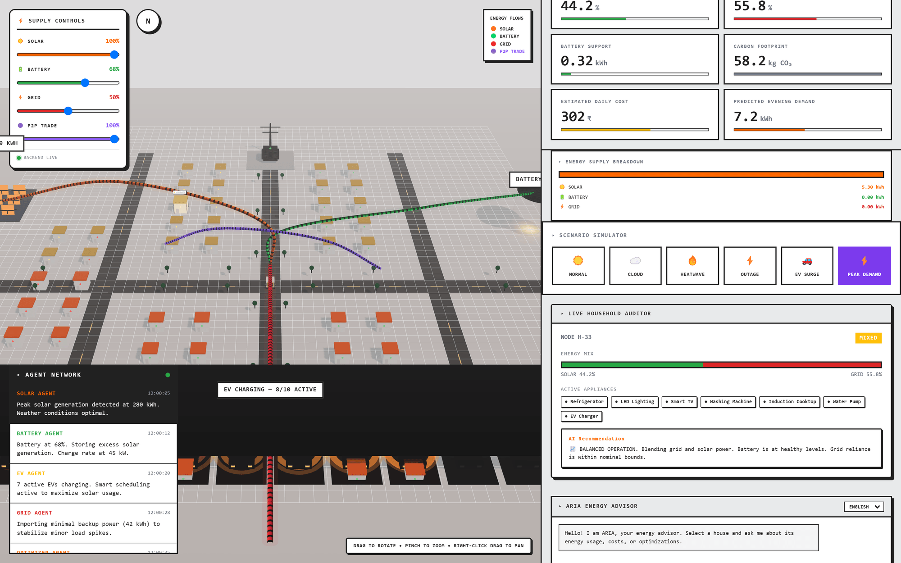

**Peak demand** is the flagship scenario: community demand roughly doubles. All four
corridors light at once — solar, battery, grid *and* a violet P2P transfer — and EV
charging saturates at `10/10`. This is the case the whole system was built for: the
community is meeting a spike from local resources before the grid has to absorb it.

### The autonomous resilience layer

<table>
<tr>
<td width="50%"></td>
<td width="50%">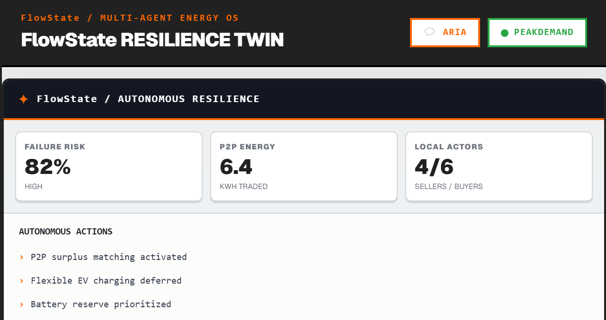</td>
</tr>
<tr>
<td><b>At rest</b> — failure risk LOW, a small volume of P2P energy traded, and the
autonomous actions sit in monitoring mode: risk monitoring active, surplus scanning
active, recovery on standby.</td>
<td><b>Under load</b> — the same panel with the risk score, traded volume and
sellers/buyers count recomputed from the current community state.</td>
</tr>
</table>

The three headline numbers are `risk_score`, kWh traded locally, and how many homes are
acting as sellers versus buyers — the shape of the local market this cycle.

### Live agent negotiation

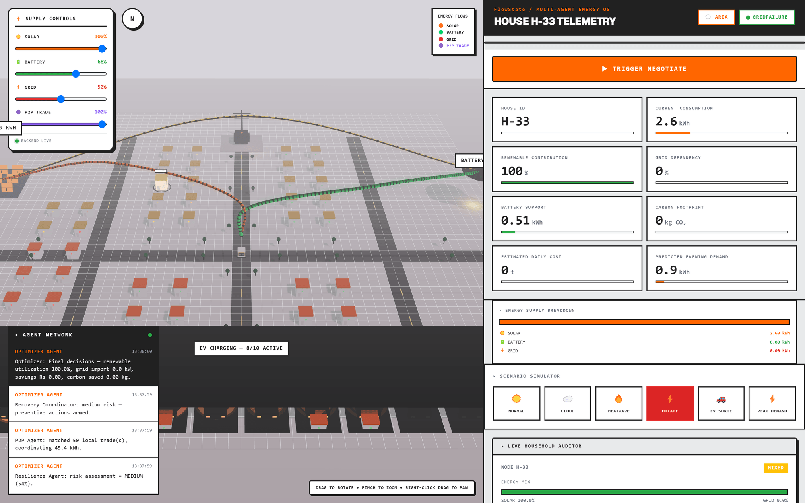

`TRIGGER NEGOTIATE` opens a WebSocket to `/ws/negotiate`. The backend runs
`langgraph_app.stream(state)` and forwards each node's new log lines as that node
executes, with a 0.38 s pace between lines — so the overlay reads as the agents
thinking rather than as a result appearing all at once.

The screenshot above is a `grid_failure` run: the resilience agent scores the risk at
MEDIUM (54%), the P2P agent matches 50 local trades worth 45.4 kWh, and the optimizer
closes at 100% renewable utilisation with **0.0 kW of grid import** — the community is
carrying itself. Here is a `peak_demand` run captured from the same socket:

```text
Solar      Scenario [peak_demand]: community demand increased from 163.1 kWh to 273.8 kWh.
Solar      Generation 309.9 kWh, surplus of 36.1 kWh available for battery/grid export.
Battery    SoC 39.8%, health 86.4%, available discharge 25.9 kWh.
Battery    Solar surplus 36.1 kWh exceeds 20% of capacity — recommending charge of 30.0 kWh.
House      Processed 50 households — total demand 273.8 kWh (avg 5.48 kWh/house).
House      14 flexible, 9 critical households; 51.9 kWh of deferrable load available.
EV         10 EVs tracked — 8 charging now, total charge needed 97.4 kWh.
EV         9 EV(s) V2G-eligible (flex window >= 4h).
```

None of this is scripted in the frontend. If the socket cannot be reached the store
falls back to a canned replay so a demo never dead-ends on a dropped backend — you can
tell the two apart by the timestamp format: the backend sends `13:38:00`, the fallback
uses the browser's locale string (`1:38:00 pm`).

### ARIA, the energy advisor

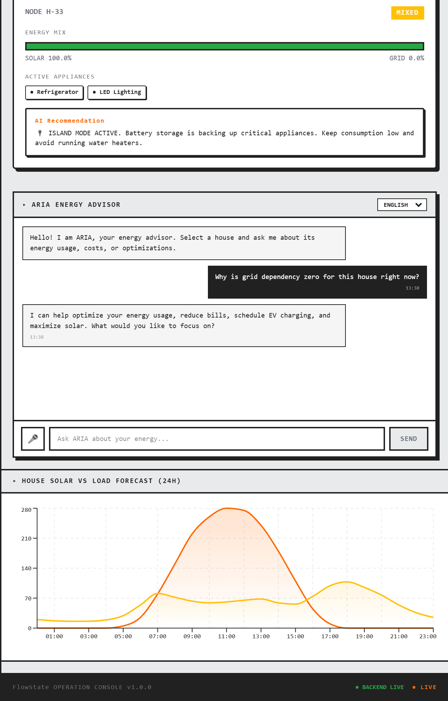

ARIA's system prompt is built from the live community state — solar generation, battery
level, grid import, EVs charging, renewable share, active scenario — plus the selected
house, so answers are grounded in what is actually on screen. Groq
`llama-3.1-8b-instant` does the reasoning and Sarvam AI handles speech-to-text and
text-to-speech behind the microphone button, with English, Hindi, Telugu and Urdu
supported.

**The reply in this screenshot is the keyless mock response**, which is why it offers
help rather than answering the question — this capture ran without a `GROQ_API_KEY`.
That is the designed degradation: both LLM clients fall back to mock mode and the
console, the agents and the twin stay fully usable. Set the key to get a real answer.

Below ARIA, the household auditor's rule-based recommendation (`ISLAND MODE ACTIVE.
Battery storage is backing up critical appliances…`) needs no LLM at all, and the 24 h
solar-vs-load forecast chart is drawn straight from community state.

### The backend API

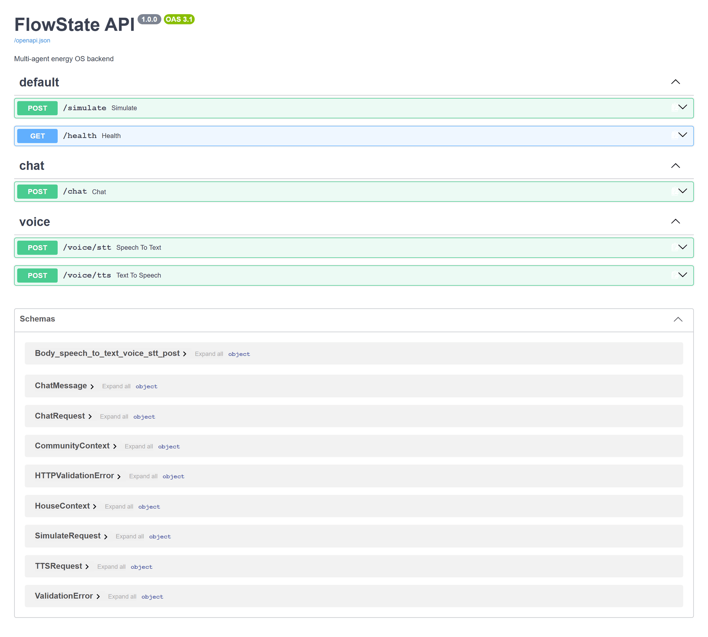

FastAPI serves interactive docs at `http://localhost:8000/docs`.

---

## Architecture

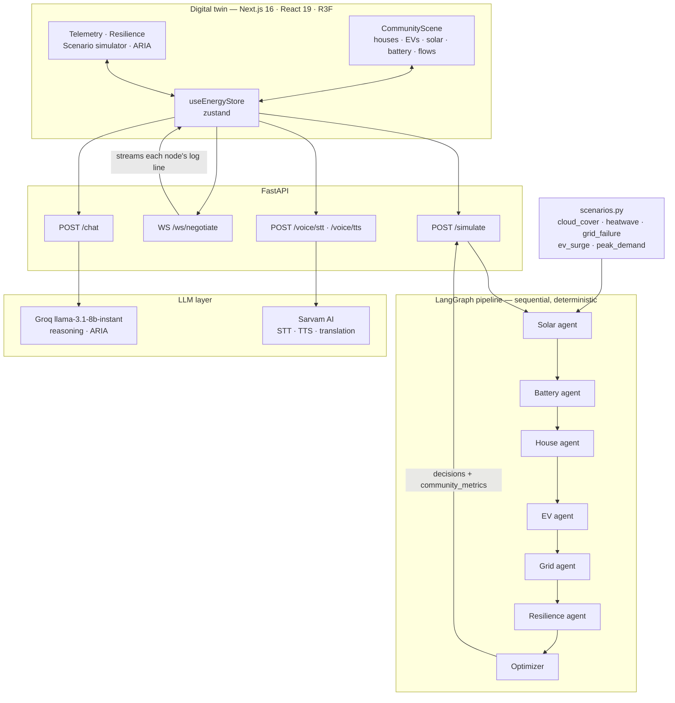

Two properties make this tractable:

1. **The graph is sequential and deterministic.** No branching, no subgraphs, no dynamic
   routing — `Solar → Battery → House → EV → Grid → Resilience → Optimizer`, every cycle.
   The same `CommunityState` flows through and each agent both reads and appends to it,
   so any output can be traced back to the node that produced it.
2. **The state schema is a contract.** `agents/state.py` carries an explicit
   *"DO NOT MODIFY FIELD NAMES — frontend and backend depend on these shapes"*, and the
   optimizer documents its output contract the same way. The twin can bind directly to
   agent output because that output is pinned.

---

## The resilience agent in detail

The resilience layer is deterministic, not learned. Risk is a weighted sum of four
normalised pressures:

```text
risk =  demand_pressure  × 0.35     # community demand against available supply
      + battery_stress   × 0.20     # how little headroom storage has left
      + ev_pressure      × 0.15     # share of the fleet drawing charge right now
      + outage_factor    × 0.30     # 1.0 when the grid is unavailable, else 0
                                     # clamped to [0, 1]
```

```text
risk ≥ 0.70   HIGH     autonomous recovery planned
risk ≥ 0.40   MEDIUM   preventive actions armed
otherwise     LOW      monitoring only
```

**Peer-to-peer coordination.** The agent pairs homes with surplus against homes in
deficit and records simulated transfers — reported to the UI as kWh traded and a
sellers/buyers count.

**Autonomous recovery.** At `HIGH` risk the agent emits an ordered plan drawn from what
is actually available this cycle:

1. Execute the local P2P transfer it just matched
2. Reserve the community battery for critical demand
3. Defer flexible EV charging — naming the vehicles with a flex window over an hour
4. Shift flexible household loads — naming the homes with flexibility ≥ 0.5
5. Maintain island mode when grid import is unavailable

The plan is *recommended*, not executed against hardware. FlowState is a simulation and
decision-support system; nothing in this repository actuates a physical switch.

---

## Repository layout

```text
Bit_N_Build/
├── backend/
│   ├── main.py                   FastAPI app, CORS, router mounting, /health
│   ├── requirements.txt
│   ├── agents/
│   │   ├── graph.py              LangGraph topology (sequential, no branching)
│   │   ├── state.py              CommunityState schema — a pinned contract
│   │   ├── solar_agent.py        generation, 24 h forecast, surplus, low-gen windows
│   │   ├── battery_agent.py      SoC, health, available discharge, charge/discharge
│   │   ├── house_agent.py        all 50 households in one vectorised pass
│   │   ├── ev_agent.py           schedules, flex windows, V2G eligibility, priority
│   │   ├── grid_agent.py         pricing, availability, carbon intensity, peak hours
│   │   ├── resilience_agent.py   risk score, P2P coordination, recovery plan
│   │   ├── optimizer.py          dispatch, EV pause, load deferral, savings, carbon
│   │   ├── scenarios.py          the five state mutations behind the simulator
│   │   ├── run.py                entrypoint + mock community generators
│   │   ├── logger.py             agent negotiation log helper
│   │   └── test_*.py             37 unit tests across agents and the optimizer
│   ├── routers/
│   │   ├── simulate.py           POST /simulate and WS /ws/negotiate
│   │   ├── chat.py               POST /chat — ARIA's grounded system prompt
│   │   └── voice.py              POST /voice/stt and /voice/tts
│   └── llms/
│       ├── groq_client.py        reasoning brain (llama-3.1-8b-instant)
│       └── sarwam_client.py      STT / TTS / translation
│
├── frontend/
│   └── src/
│       ├── app/page.tsx          the console shell and every dashboard panel
│       ├── store/useEnergyStore.ts   zustand state, polling, WS negotiation
│       ├── data/mockData.ts      offline community + per-scenario agent scripts
│       ├── hooks/                useBackendHealth · useAgentWebSocket · useVoiceRecorder
│       ├── components/digitalTwin/   CommunityScene · CommunityGrid · House · SolarFarm ·
│       │                             Battery · EVZone · EnergyFlow · ScenarioEffects ·
│       │                             AgentOverlay
│       └── components/dashboard/     EnergySliders · ScenarioControls · ResiliencePanel
│
└── docs/screenshots/             the images in this README
```

---

## Quickstart

### Prerequisites

| Component | Requirement |
| --- | --- |
| Digital twin | Node 20 or newer (built and tested on Node 24) |
| Agent backend | Python 3.11+ and `backend/requirements.txt` |
| LLM features | Optional Groq and Sarvam API keys — everything degrades to mock mode without them |

### 1 · Backend

```bash
cd backend
python -m venv venv
venv\Scripts\activate          # Windows;  source venv/bin/activate on macOS/Linux
pip install -r requirements.txt

# Optional — create backend/.env and keep it out of git:
#   GROQ_API_KEY=your_key
#   SARWAM_API_KEY=your_key

uvicorn main:app --reload
```

The API comes up on `http://localhost:8000`, with interactive docs at `/docs`. Without
keys the log will say `SarvamClient running in MOCK mode` — that is expected, and the
agent pipeline itself needs no keys at all.

### 2 · Frontend

```bash
cd frontend
npm install
npm run dev
```

Open `http://localhost:3000`. **Use `localhost`, not `127.0.0.1`** — the store derives
the backend origin from `window.location.hostname` (see [Known issues](#known-issues)).

Drag to rotate the community, scroll to zoom, click any house to open its telemetry,
then use the scenario simulator to put the agents under load.

### 3 · Hosted build

A frontend build is live at **[bit-n-build-wine.vercel.app](https://bit-n-build-wine.vercel.app/)**.
It runs in mock mode against `data/mockData.ts`, so the steps above are only needed to
exercise the real Python agents.

---

## API reference

Base URL `http://localhost:8000`. Interactive docs at `/docs`.

| Method | Path | Purpose |
| --- | --- | --- |
| `GET` | `/health` | liveness — the twin polls this every 15 s to set BACKEND LIVE / MOCK MODE |
| `POST` | `/simulate` | run the full pipeline once; returns `decisions`, `resilience`, `community_metrics`, `logs` |
| `WS` | `/ws/negotiate` | stream each agent's log line as its LangGraph node executes |
| `POST` | `/chat` | ARIA — grounded in the selected house and community context |
| `POST` | `/voice/stt` | speech to text (Sarvam) |
| `POST` | `/voice/tts` | text to speech (Sarvam) |

`/simulate` and `/ws/negotiate` both accept `scenario`, `solar_pct`, `battery_pct` and
`grid_pct`, so the Supply Controls sliders and the scenario simulator are genuine inputs
to the agent run.

---

## Testing

```bash
cd backend
pip install pytest
python -m pytest agents -q
```

Verified on this checkout (Windows 11, Python 3.14):

| Suite | Tests | Result |
| --- | ---: | --- |
| `test_solar.py`, `test_battery.py`, `test_house.py`, `test_ev.py` | — | ✅ pass |
| `test_scenarios.py` | — | ✅ pass |
| `test_optimizer.py` | — | ⚠️ 1 failure — see below |
| **Total** | **37** | **36 passed, 1 failed** |

The one failure is a stale assertion rather than a broken agent.
`test_run_cycle_returns_decisions_only` pins the optimizer's output keys to an exact set:

```text
AssertionError: Extra items in the left set: 'resilience'
```

The resilience layer added a `resilience` key to the decisions payload and
`EXPECTED_KEYS` in `agents/test_optimizer.py` was never updated. The fix is to add
`"resilience"` to that set.

The suite covers agent outputs, scenario mutations, and the optimizer's dispatch
contract. There are no frontend tests.

---

## Known issues

Recorded honestly, because both are easy to trip over when running this locally.

**1 · `peakDemand` is missing from the frontend's offline scenario data.**
`ScenarioControls` offers six scenarios, but `scenarioData` in `data/mockData.ts`
defines only five — `normal`, `cloudCover`, `heatwave`, `gridFailure`, `evSurge`. When
the WebSocket negotiation falls back to the scripted replay while **PEAK DEMAND** is
active, `_runMockNegotiation()` reads `scenarioData['peakDemand'].agentDecisions` and
throws:

```text
TypeError: Cannot read properties of undefined (reading 'agentDecisions')
```

The Agent Network overlay is then left empty on `AWAITING NETWORK NEGOTIATION…`. The fix
is a `peakDemand` entry in `scenarioData`; a guard in `_runMockNegotiation()` would make
it safe regardless.

**2 · The backend origin is hardcoded to port 8000 in the browser.**
`getHttpUrl()` and `getWsUrl()` in `store/useEnergyStore.ts` return
`` `http://${window.location.hostname}:8000` `` whenever `window` exists, so
`NEXT_PUBLIC_BACKEND_URL` and `NEXT_PUBLIC_BACKEND_WS_URL` are ignored client-side —
they only apply during SSR. Two consequences: the backend must be on port 8000, and the
frontend must be opened on the same hostname the backend is reachable at (use
`localhost:3000`, not `127.0.0.1:3000`). `useBackendHealth` *does* read the env var, so
a mismatch shows the confusing combination of a green `BACKEND LIVE` badge next to a
negotiation that silently falls back to mock data.

**3 · Every resilience log line is attributed to the Optimizer.**
`AGENT_DISPLAY_NAMES` in `routers/simulate.py` maps six graph nodes but not
`resilience_agent`, so its lines go out labelled `"System"`. The frontend's `agentMap`
has no `System` either, and its `?? 'Optimizer'` default catches them. The result is
visible in the negotiation screenshot: the risk assessment, the P2P match and the
recovery-coordinator line all read **OPTIMIZER AGENT**. The messages are correct — only
the attribution is wrong. Fixing it takes one entry in each map.

---

## Roadmap

- [ ] Add the missing `peakDemand` scenario data and guard the mock fallback
- [ ] Honour `NEXT_PUBLIC_BACKEND_URL` / `NEXT_PUBLIC_BACKEND_WS_URL` in the browser
- [ ] Update `EXPECTED_KEYS` so the optimizer contract test passes again
- [ ] Map `resilience_agent` in both display-name tables so its log lines are attributed correctly
- [ ] Persist negotiation history so a cycle can be replayed and audited after the fact
- [ ] Real forecast data in place of the synthetic 24 h curve
- [ ] Settlement and pricing for P2P transfers, not just matched volume
- [ ] Frontend test coverage — there is currently none
- [ ] Hardware-in-the-loop against a real inverter or battery management system

---

## Ownership

FlowState was designed and built entirely by the **Bit-N-Build** team for the
Bit-N-Build hackathon: the multi-agent energy architecture, the simulation environment,
the digital-twin interface, the energy optimisation components, the resilience layer,
P2P coordination, autonomous recovery planning and the FlowState visualisation.

<div align="center">
<br>
<b>Prithvi S P</b> · <b>Darshan Pawar</b> · <b>Chandan Kumar K</b>
<br><sub>Track: Decentralised Energy Systems & Micro-Grids</sub>
</div>

# 🚨 Code Plagiarism / Unauthorized Copy

This repository appears to be an **exact copy of the previously developed and published project [[AGENTGRID](https://github.com/abd-RAHEEM/AGENTGRID)](https://github.com/abd-RAHEEM/AGENTGRID)**.

## 🔗 Original Project

**AGENTGRID:**
https://github.com/abd-RAHEEM/AGENTGRID

The original project was developed and published approximately **7 months before this repository**, with the Git commit history providing a verifiable timeline of its development.

## 🔍 Evidence of Copying

A direct comparison of the two repositories shows substantial and/or exact overlap across multiple parts of the project, including:

* Identical or substantially identical source code
* Identical project structure
* Identical file organization
* Identical implementation and logic
* Identical functionality
* Similar or identical documentation and project descriptions

This does **not appear to be merely a case of implementing the same idea or solving the same problem**.

The underlying implementation and code appear to have been directly copied from the original project.

## 🕒 Development Timeline

The original repository contains Git commits dating back approximately **7 months**, establishing that the project and its implementation existed publicly well before this repository.

The commit history can be independently verified through GitHub:

**Original repository:**
https://github.com/abd-RAHEEM/AGENTGRID

## ⚠️ Hackathon Submission

If this repository is being submitted to a **hackathon or competition as original work**, I request that the organizers review the development history and compare both repositories before evaluating the submission.

The Git history, source code, and repository contents provide independently verifiable evidence that the original implementation predates this repository.

## 📌 Request

Please clarify the origin of the code used in this repository and provide appropriate attribution to the original project and author.

If the code was copied without permission or without complying with the original project's license, I request that the copied material be removed or that the repository be appropriately corrected and attributed.

---

### Original Work

**Repository:** https://github.com/abd-RAHEEM/AGENTGRID
**Development history:** Approximately 7 months prior to this repository

> This issue is being raised to document the apparent code duplication and allow the repository owners and, if applicable, hackathon organizers to independently verify the claims using the publicly available Git history and source code.
